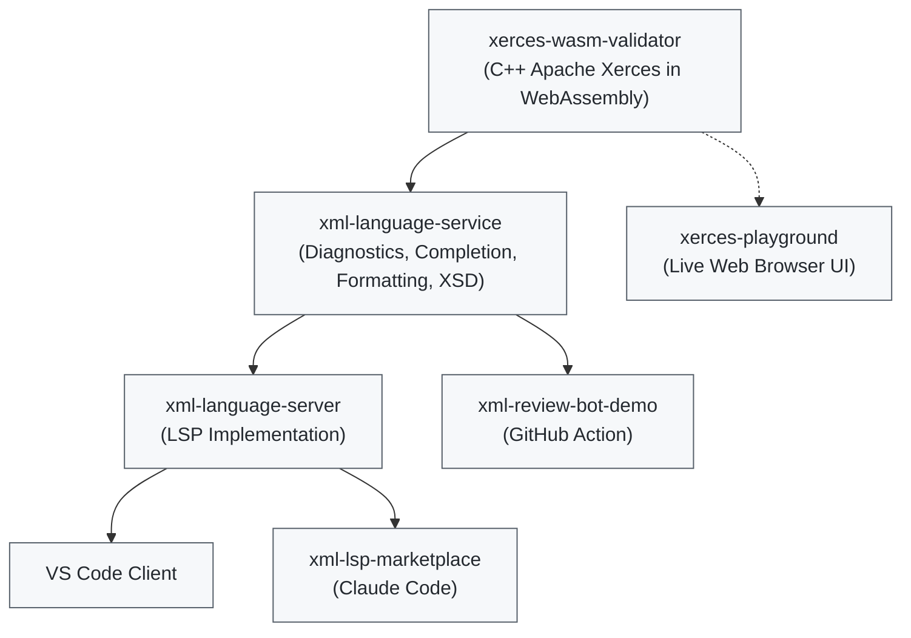

> ⚠️ **Note:** This is an "Umbrella Repository" used for documentation and architectural overview. The actual source code is distributed across the individual repositories linked below.
> 
#  XML Language Ecosystem (Multi-Repo Architecture)
A high-performance XML tooling ecosystem powered by WebAssembly, Apache Xerces, and the Language Server Protocol (LSP). 100% TypeScript, zero Java dependencies.

## System Architecture

## Ecosystem Repositories

### Core Engines & Validation

* **[xerces-wasm-validator](https://github.com/harshanacz/xerces-wasm-validator)**: Apache Xerces-C++ compiled to WebAssembly. Provides zero-dependency, high-speed XML/XSD schema validation in Node.js and browser environments using WASM Linear Memory caching.  [Benchmark](https://github.com/harshanacz/xml-val-benchmark)
* **[xml-language-service](https://github.com/harshanacz/xml-language-service)**: The core TypeScript engine for XML diagnostics, auto-completion, formatting, and structural validation. Uses `xerces-wasm-validator` under the hood. 

### Language Server Protocol (LSP)
* **[xml-language-server](https://github.com/harshanacz/xml-language-server)**: Full LSP implementation built on top of `xml-language-service`, enabling real-time IDE features over standard JSON-RPC protocol.

### Clients & Integrations
* **[xml-language-client](https://github.com/harshanacz/xml-language-client)**: Official VS Code extension client connecting to `xml-language-server`.
* **[xml-lsp-marketplace](https://github.com/harshanacz/xml-lsp-marketplace)**: XML Language Server integration for Claude Code AI workflows.
* **[xml-review-bot-demo](https://github.com/harshanacz/xml-review-bot-demo)**: Automated GitHub Action using `xml-language-service` to run instant diagnostics on pull requests.

### Playgrounds & Demos
* **[xerces-playground](https://github.com/harshanacz/xerces-playground)**: Interactive browser-based playground for validating XML files directly in the client without any backend calls. [Try it](https://xerces-wasm.harshanacz.com/)
